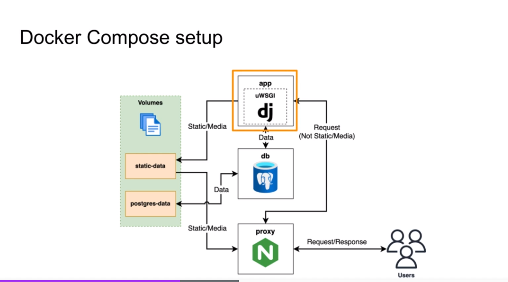

# django_rest

test http://127.0.0.1:8000/api/docs/#/

# Schema



# Handling Configuration

- create .env file on server
- set values in docker compose

# uWSGI

add in dockerfile :

```DOCKER
COPY ./app /app
...
 build-base postgresql-dev musl-dev  zlib zlib-dev linux-headers &&\
...
chmod -R x /scripts
...
CMD ["run.sh"]
ENV PATH="/scripts:/py/bin:$PATH"
```

- add `linux-headers` in the second line
- add `/scripts:` in ENV PATH

add file /scripts/run.sh

```
#!/bin/sh

set -e

python manage.py wait_for_db
python manage.py collectstatic --noinput
python manage.py migrate

uwsgi --socket :9000 --workers 4 --master --enable-threads --module app.wsgi
```

app.wsgi is created automatically ( wsgi.py )
